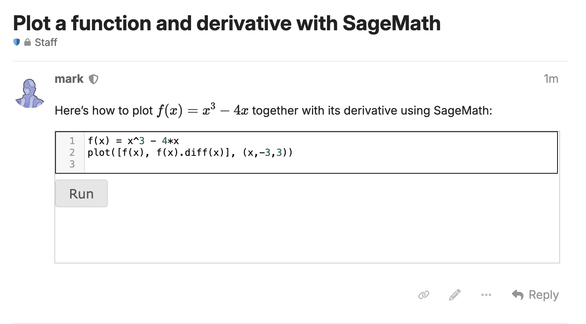
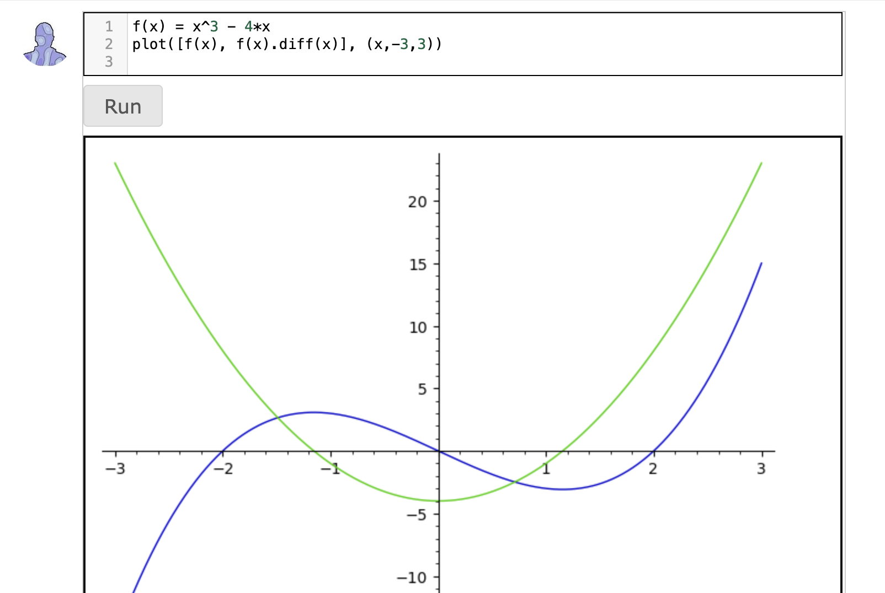

# Discourse-Sage-Math

Discourse-Sage-Math is a theme component for [Discourse](https://github.com/discourse/discourse) that allows you to easily embed active [SageMath]() code into a Discourse post. The code can be evaluated using the [SageCell Server API]().

A sage-fenced code block looks like so:

    ```sage
    f(x) = x^3 - 4*x
    plot([f(x), f(x).diff(x)], (x,-3,3))
    ```

Placing that code block into a post would yield the following in the rendered post:



Hitting the "Run" button should send the code to the Sage Cell server where it's evaluated; the result looks like so:


